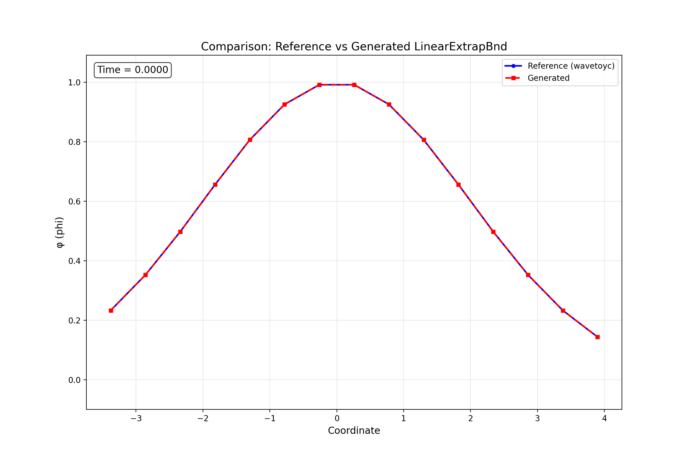

# Observation
During the evaluation of Einstein Toolkit code generation using LLM, several interesting examples appeear, where the code generation quality could be improved by better physical understanding. Here one example (`"example_index": 4` in the result file `evaluation_results_20250926_151202.json`) is discussed. 

Reading the log, we can see the generated code builds and runs successfully but produces slightly incorrect numerical results, for instance: `File phi_3D_diagonal.xg: Line 36: '3.8971143170300\t\t0.0000000000000' != '3.8971143170300\t\t0.1147438523199'\n`

# Visualization

The animation below shows the time evolution of the wave field φ along the diagonal, comparing the reference solution (blue solid line) with the generated code output (red dashed line):



We seem to see some errors at the boundaries, and the errors gradually propagate to the entire domain.

# Interpretation

If we compare the original code `LinearExtrapBnd.c` with the generated code `generated_code.c`, we can see that the functionality is mostly correct (and apparently the model is not simply reciting the original code). The critical difference is the boundary condition treatment at the end of codes:

In `LinearExtrapBnd.c`:
```c
    /* Decide on which faces the bc should be applied */
    for (j=0; j<2*dim; ++j)
    {
      doBC[j] = lsh[j/2] > widths[i]+2 && bbox[j];
    }

    /* see if we have a physical boundary */
    symtable = SymmetryTableHandleForGrid (GH);
    if (symtable < 0) CCTK_WARN (0, "internal error");
    err = Util_TableGetIntArray (symtable, 2 * dim, symbnd, "symmetry_handle");
    if (err != 2 * dim) CCTK_WARN (0, "internal error");
    for (j = 0; j < 2 * dim; j++)
    {
      is_physical[j] = symbnd[j] < 0;
    }

    /* Only do bc on faces without a symmetry bc */
    for (j=0; j<2*dim; ++j)
    {
      doBC[j] &= is_physical[i];
    }

    /* Apply the boundary condition */
    if( !( retval & ( 1 | 16 ) ) ) /* unless particularly bad errors */
      CCTK_FNAME(Linear_extrap_one_bndry)(doBC, lsh, var_ptr);
```

In `generated_code.c`:
```c
    /* Set up face flags - determine which faces to apply BC to */
    for (j = 0; j < 6; j++)
    {
      doBC[j] = 0;
    }

    /* If faces array is provided, use it to determine which faces to apply BC to */
    if (faces)
    {
      /* faces array contains flags for each face */
      for (j = 0; j < 6; j++)
      {
        if (j < 6 && faces[6*i + j])
        {
          doBC[j] = 1;
        }
      }
    }
    else
    {
      /* Apply to all faces if no face specification is given */
      for (j = 0; j < 6; j++)
      {
        doBC[j] = 1;
      }
    }

    /* Call the Fortran routine to do the actual work */
    CCTK_FNAME(Linear_extrap_one_bndry)(doBC, lsh, var_ptr);
```

The original code uses a set of creteria to determine which faces to apply the boundary condition to, check whether the boundaries are physical and then call the external Fortran routine to apply the boundary condition. But the generated code regard the input variable `faces` as a set of flags for each face, and call the external Fortran routine directly without actually checking the boundaries. 

This means the generated code is wrong only in the treatment of boundary conditions. This is also why we see the error originates from the boundary and gradually propagates to the entire domain.